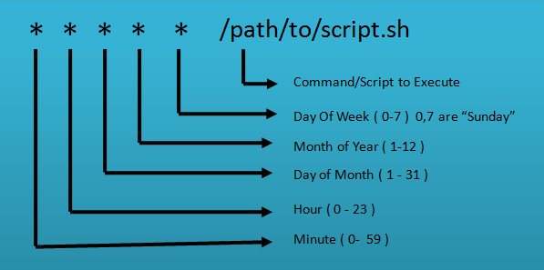

# crontab
---
Cron is a time-based job scheduler in Unix-like operating systems that automates the execution of repetitive tasks, such as running scripts or performing backups. Jobs are defined in a crontab file, which specifies the schedule and command to run. Each line in the file represents a single cron job, with the syntax consisting of minute, hour, day of the month, month, and day of the week fields, followed by the command to run. Cron runs the specified commands at the specified times, and can be used for a variety of tasks, from simple file backups to complex network management.

To create a new cron job, you would run **crontab -e** then you need to specify the command to run and the schedule on which to run it in a special file called the crontab file.

The format of a cron job is:

For example, to run a command every day at 5 PM, the cron job would look like:

`0 17 * * * /path/to/command`

In the image above, it is **script.sh** is the the script we want to automate. To list your current cron jobs, you would run **crontab -l**.

Here are some common uses of cron jobs:

* Automated backups: Creating and scheduling regular backups of important data and files.

* Scheduling regular system maintenance: Running scripts that perform system updates, disk cleanups, and other maintenance tasks.

* Running data processing and analysis tasks: Automatically processing data at specific times, such as generating reports or aggregating data.

* Scheduling recurring web scraping: Automating the retrieval of data from websites for analysis or storage.

* Automated email notifications: Sending periodic emails with updates, reports, or reminders.

* Running custom scripts: Executing scripts for specific tasks, such as updating data, triggering alerts, or managing databases.

* Automated resource management: Managing and allocating resources based on usage patterns and resource constraints.
