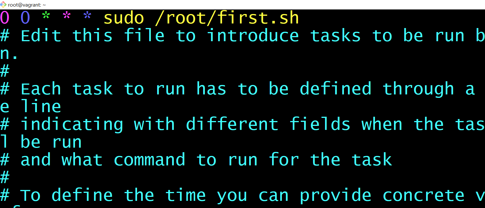

# Crob jobs
---
So, I created a cron job that backs up a particular directory in my vagrant machine every day by 00:00 Hrs. I have an Ubuntu VM running on Vagrant and I was looking for a way to backup some things in the VM on my host machine. So, vagrant has the `/vagrant` directory that it shares with the host machine so I decided to back it up there. The script was written in bash and I will run down the entire process.

First, I needed to write the write the script and be sure it works. There is this popular saying that before you automate anything, you must do it manually. So, I created a `backup.sh` file using vi editor. Inside the backup.sh we have


```bash
mkdir -p /vagrant/backup/`date +%Y-%m-%d`
```

The `date` command prints out the date in CLI. so the `+%Y-%m-%d` extracts out the Year, Month and Day in the format **YYYY-MM-DD** which will be the name of the sub-directory created since the vagrant directory already exists. The -p flag is so it doesn't throw up an error if the backup directory doesn't exist rather, it creates the directory. 

next we had 
```bash
tar -cvf /vagrant/backup/`date +%Y-%m-%d`/backup.tar /root/my_files/*
```
The above command is used to create a tarball compress the tarball and back it up in the specified location. 

The tar command is is a command-line utility in Linux that is used to create and manage archive files. An archive file is a single file that contains multiple files and/or directories, allowing you to store and organize large collections of files.
The `-c` tar command is used to create a new archive. When creating an archive, the `-c` option is used to specify that a new archive should be created while the `-v` option in the tar command is used to enable verbose output, which means it will display a list of the files and directories being added to the archive or extracted from the archive. and the `-f` option in the tar command is used to specify the name of the archive file that you want to create or extract.
After the backup.sh script has been written, I gave it execute permission using 
```bash
chmod +x backup.sh
```
before testing the script by running 
```bash
sudo ./backup.sh
```
and it worked. Then came the next phase which is the automation phase. Since I will be executing using crontab
I ran the command below
```bash
crontab -e
```
Since it was my first time running the command it gave my an option to choose an editor but I didn't understand so I exited without choosing an editor. when I tried opening again it was opening with nano which I am not familiar with. So I had to go and search for how to change the default from nano to vi

This [video](https://www.youtube.com/watch?v=86TL-LdwzkQ) was quite helpful in guilding me through the process of changing the default to vi. I used the command below to do that
```bash 
export EDITOR=vi
```
After that I created the cron job 



The `0 0 * * * `in the image means that  the job will run 0:00 hrs everyday which is 12 midnight everyday.

For more information on how to create a cron job [click here](https://github.com/NeetamDamian/crontab/blob/main/README.md)
